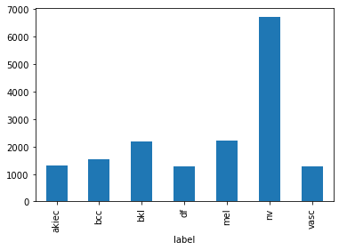

  

# Skin Cancer classification

This example shows how a transfer learning using Mobilnetv2 can be trained to classify different types of skin cancer.

This model is compatible with Perceptilabs 0.12.

## Model Overview

The model is based on MobileNetV2 using transfer learning and appening two dense layers, one of 512 neurons and relu activation and last dense layer for prediction of 7 units with softmax.

## Dataset introduction
Skin Cancer MNIST: HAM10000 balanced. This dataset is balanced using data agumentation in only the unbalanced classes to increase the number of images in each minority classes.

Unbalanced data distribution:

Disatribution after increase number of images of minority classes:

## License
**CC BY-NC-SA 4.0**

### Processed and extracted data from 
Kaggle dataset: https://www.kaggle.com/kmader/skin-cancer-mnist-ham10000

### Original Data Source
Original Challenge: https://challenge2018.isic-archive.com
https://dataverse.harvard.edu/dataset.xhtml?persistentId=doi:10.7910/DVN/DBW86T
[1] Noel Codella, Veronica Rotemberg, Philipp Tschandl, M. Emre Celebi, Stephen Dusza, David Gutman, Brian Helba, Aadi Kalloo, Konstantinos Liopyris, Michael Marchetti, Harald Kittler, Allan Halpern: “Skin Lesion Analysis Toward Melanoma Detection 2018: A Challenge Hosted by the International Skin Imaging Collaboration (ISIC)”, 2018; https://arxiv.org/abs/1902.03368
[2] Tschandl, P., Rosendahl, C. & Kittler, H. The HAM10000 dataset, a large collection of multi-source dermatoscopic images of common pigmented skin lesions. Sci. Data 5, 180161 doi:10.1038/sdata.2018.161 (2018).
